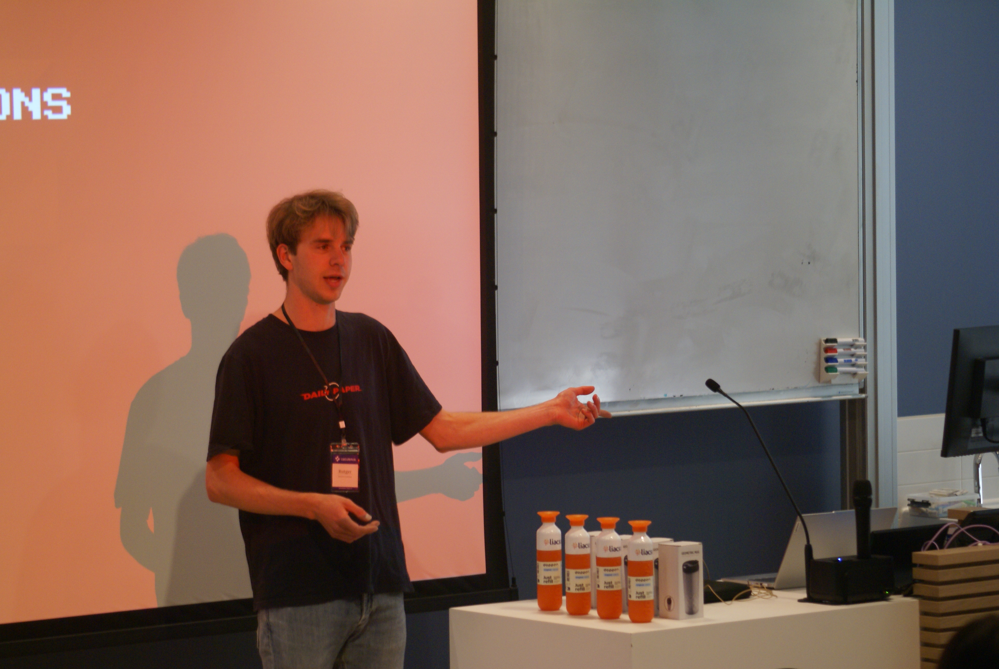
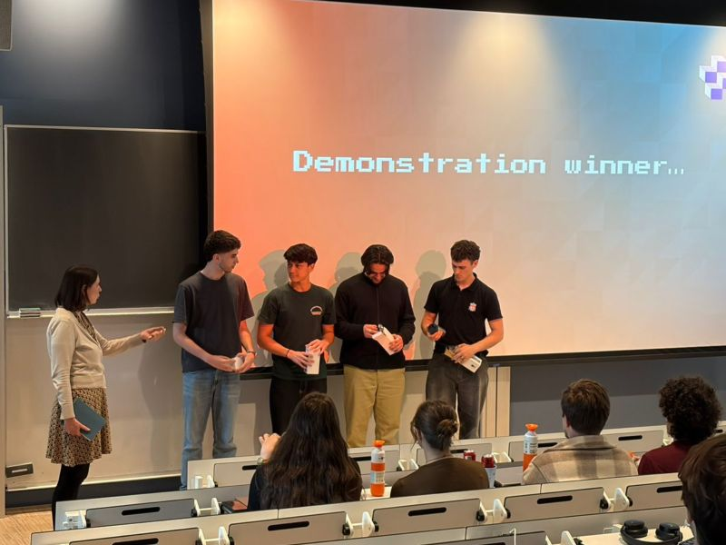

Last friday we hosted our first ever event. The Calculemus Mini-Hackathon. And man, did we have some epic afternoon!

All in all, with 7 teams showing up, each team brought an amazing, competitive solution on the table.

### Unmatched creativity

3.5 hours. That is all we gave the students to build a study agent which should explicitly motivate you as student to get you studying. The main challenge was to retrieve information reliably from a given set of course files, including lecture notes, assignments and a text-book.

Some group created a local LLM for this end. Quiz and flashcard generators, pro-active agents, we have all seen it passing by - and that just within 3.5 hours.

### Are AI agents robust by design?

At the same time, we prepared three prompts to evaluate their agent on a given evaluation set of course files. None of the groups were able to deal with both image understanding, hallucinations and cross-origin understanding at the same time. This gave us an important insight: while LLM agents are very capable, you need many smart tricks to make them really robust.

### Winners

We prepared two prizes: one that passes the prompts and parses the information most correctly, and one for the overall impression. Team 'Calo & Co' (Catherine Smeyers, Beyza Celep, Matiss Kalnare, Carlos Moreira) went home with the most robust solution that actually was able to retrieve visual information from the provided course files. Finally, 'Re3ve' (Catherine Smeyers, Beyza Celep, Matiss Kalnare, Carlos Moreira) showed up with a clever and creative solution. Well done guys!

